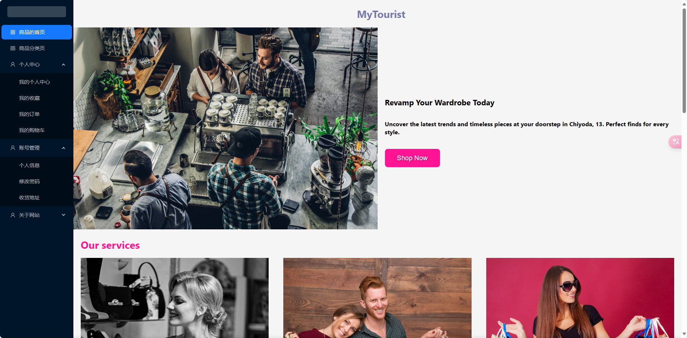
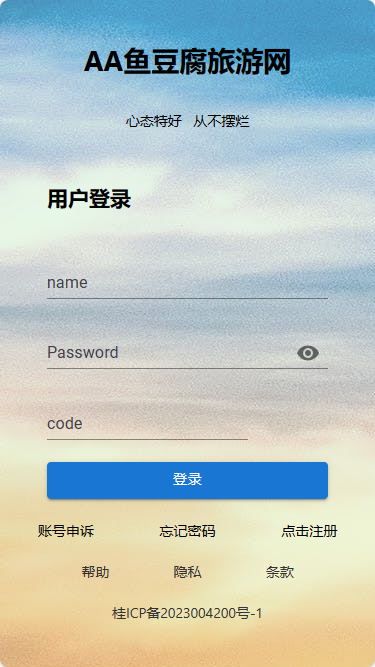
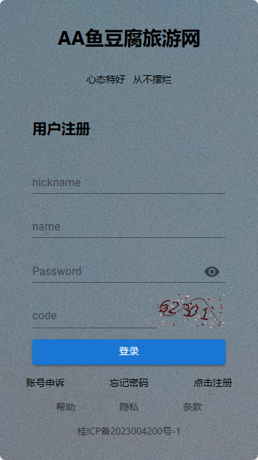
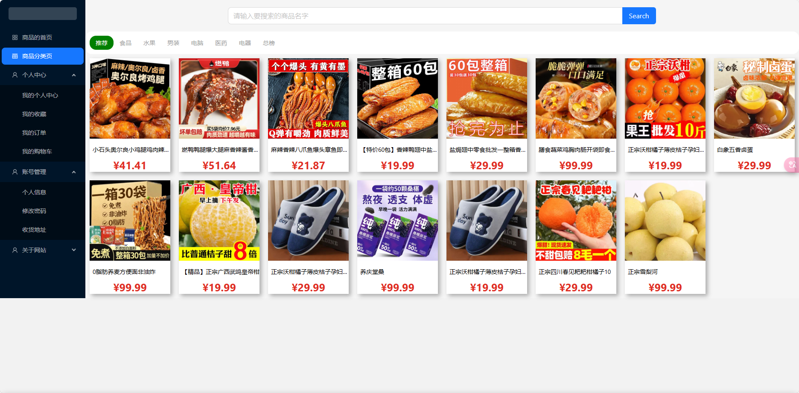
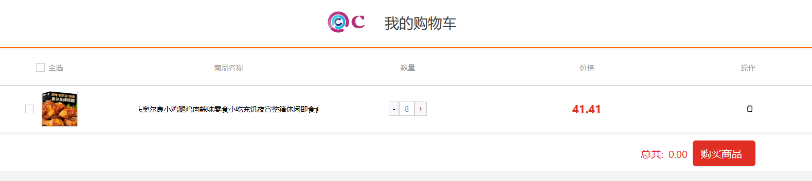
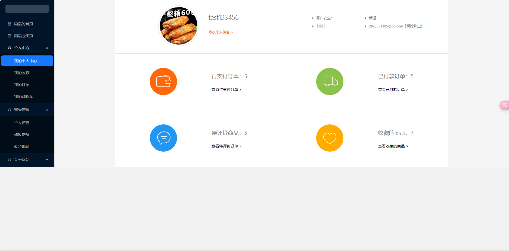
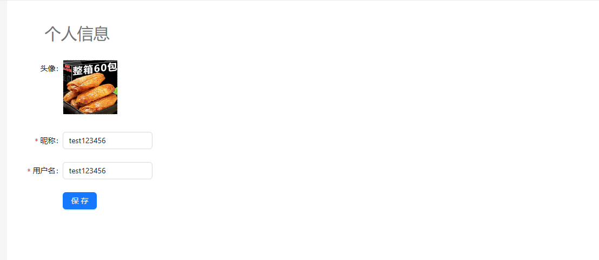

# 旅游网-模拟商城

# docker-compose 运行

## 先拷贝代码
git clone https://github.com/PokemanMaster/lvyouwang-project.git
cd lvyouwang-project

## 使用docker-compose启动
```
docker compose up -d
```


# 本地运行
```
用户名：admin1234
密码：123456
```

## 前端

## 项目依赖

- React
- React-router
- ReactX
- Ant-design
- Axios

## 运行

```
git clone git clone https://github.com/PokemanMaster/tourist-client.git
cd client
npm i || npm yarn
npm run start
```
## 备注

项目运行后启动在 3000 端口
项目支持移动端（推荐）和PC端
模拟了选择商品、地址到下单全部流程
项目的后端地址: https://github.com/PokemanMaster/tourist-client

## 图片展示

首页



登录



注册



全部商品



商品详情


收藏


订单


购物车



个人中心



个人信息




# 后端

## 前言

本人准备大四，拿这个项目学习一些新的技能，如果有错误或者实现不好的地方欢迎 issues
如果觉得这个项目不错，您可以右上角 Star 支持一下！谢谢您的支持，您的支持是我完善的动力！
项目运行后启动在 3000 端口
前端项目地址: https://github.com/PokemanMaster/tourist-server
项目是前后端的项目

## 项目依赖
本项目采用了一系列 golang 中比较流行的组件来进行开发

- Gin
- Gorm
- mysql
- redis
- jwt-go

## 目录结构
```
server/
├── api
├── cache
├── conf
├── middleware
├── model
├── pkg
│	├── e
│	├── util
│   ├── sdk
├── route
├── serializer
└── service
└── test
```
- api：用于定义接口函数
- cache：redis 相关操作
- conf：用于存储配置文件
- middleware：应用中间件
- model：应用数据库模型
- pkg / e：封装错误码
- pkg / util：工具函数
- pkg / sdk: 极验 sdk 核心函数
- serializer：将数据序列化为 json 的函数
- route 路由逻辑处理
- service：接口函数的实现

## 运行
```
git clone https://github.com/PokemanMaster/tourist-server.git
cd server
go run main.go
```

